# ROS2开发手册

## 节点编程逻辑顺序：

1.（面向过程）

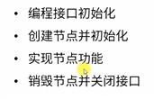

2.（面向对象） 

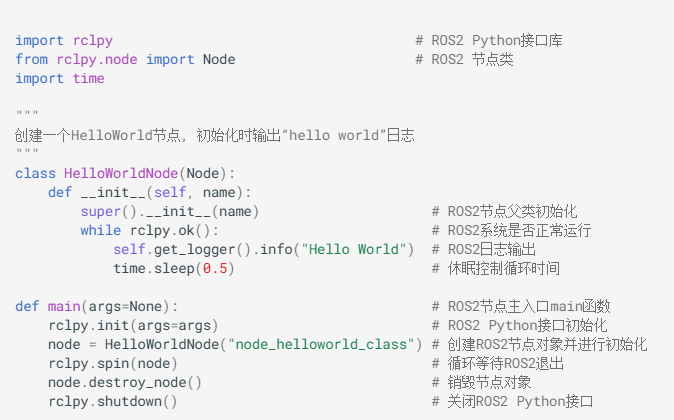

**注意：修改代码之后一定要重新编译 把代码编译到install 上面

$ colcon build

## 话题

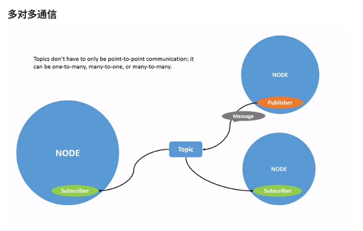

可以有多个subscriber 也可以有多个publisher **（如果有多个Publisher 要注意区分==优先级==）

** 话题通信是异步通信

**用 .msg 后缀的文件自行定义

==函数引用==：

==创建发布者==：   `self.pub = self.create_publisher(String, "chatter", 10)   # 创建发布者对象（消息类型、话题名、队列长度）`

==创建发布的消息==：`msg = String()                                            创建一个String类型的消息对象`       

 `msg.data = 'Hello World'                                  # 填充消息对象中的消息数据`

==发布话题消息==：`self.pub.publish(msg)                                   # 发布话题消息`

==创建订阅者==： `self.sub = self.create_subscription(\            String, "chatter", self.listener_callback, 10) # 创建订阅者对象（消息类型、话题名、订阅者回调函数、队列长度）`

## 服务器：类似**你问我答的同步通信**效果

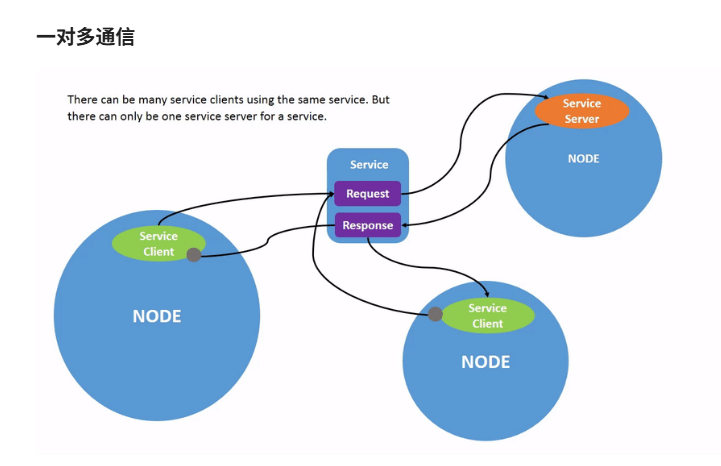

- **服务器是==唯一==的 可以有多个==客户==

- 使用的是.srv文件传输数据

`self.srv = self.create_service(AddTwoInts, 'add_two_ints', self.adder_callback)  # 创建服务器对象（接口类型、服务名、服务器回调函数）`

- 创建回调函数

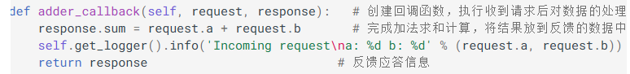

不用管如何发出去response 只用记得回调函数如何返回response即可 

- 创建服务客户端的程序流程：

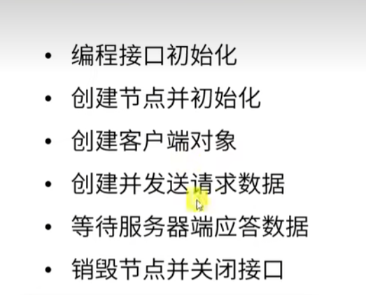

- 创建服务器服务端的程序流程：

  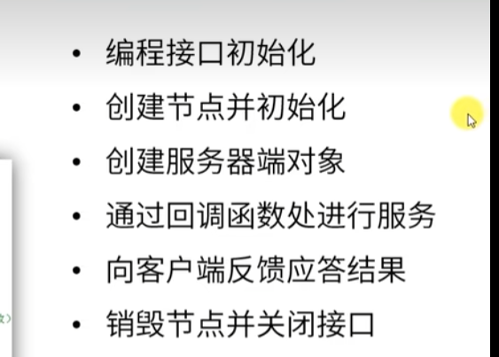‘

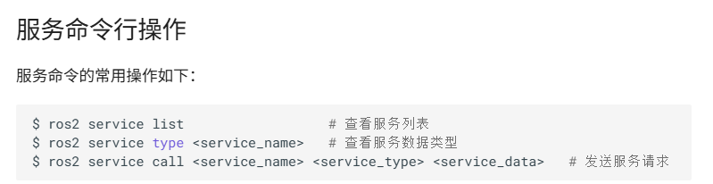

## 通信接口：给传递的数据定义一个标准的结构，这就是通信接口。

接口可以让程序之间的依赖降低，便于我们使用别人的代码，也方便别人使用我们的代码，这就是ROS的核心目标，减少重复造轮子。

ROS有三种常用的通信机制，分别是**话题、服务、动作**，通过每一种通信种定义的接口，各种节点才能有机的联系到一起。

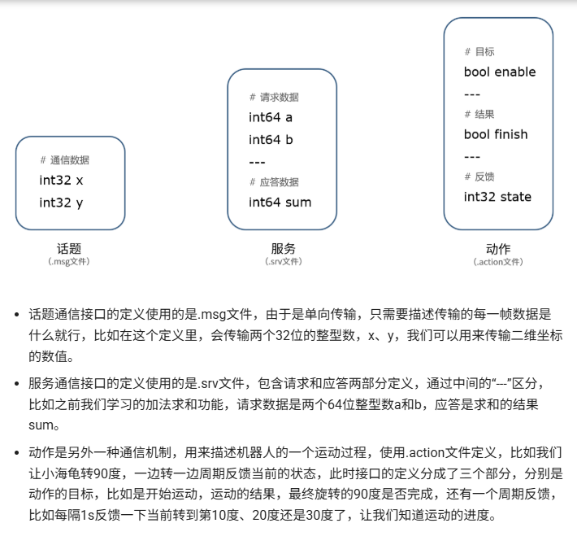

## 动作

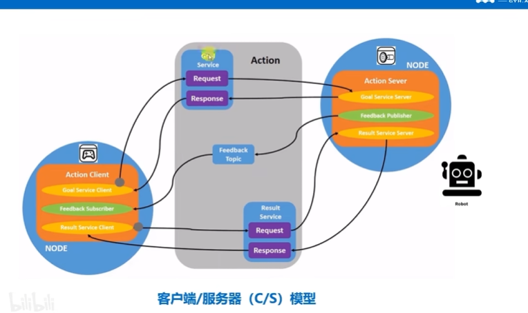

## 参数

类似C++编程中的全局变量，可以便于在多个程序中共享某些数据，**参数是ROS机器人系统中的全局字典，可以运行多个节点中共享数据。**

### 参数列表的查看，修改，查询

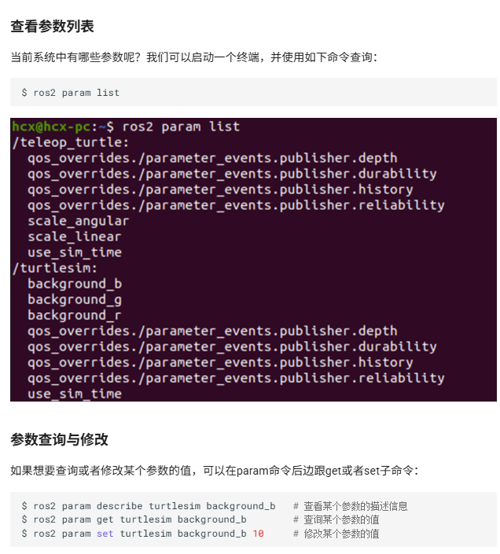

### 参数文件

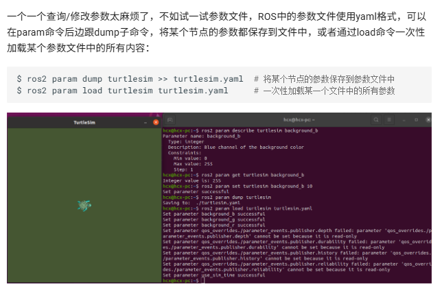

### 参数文件的保存和加载

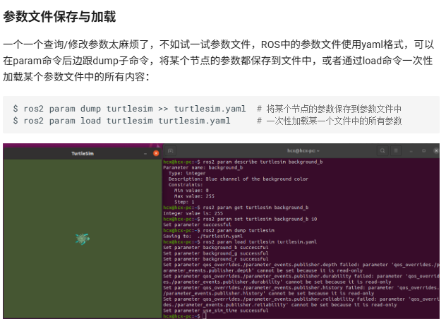

load：相当于加载修改后的参数文件的参数值到系统

## 分布式网络分组(DDS)

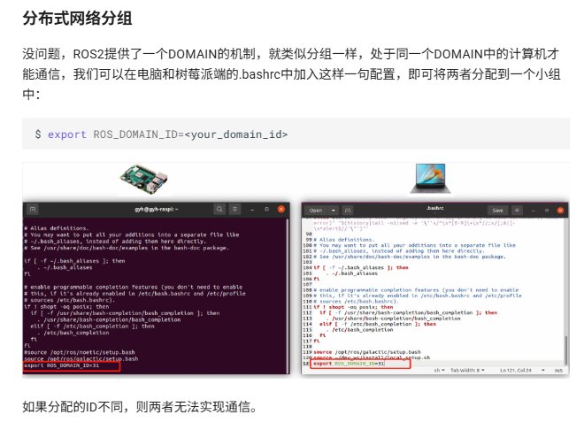

## Launch文件：实现多节点的配置和启动

### 配置launch文件的 package 和executable 可执行文件

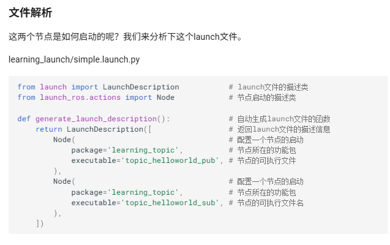

### 重映射

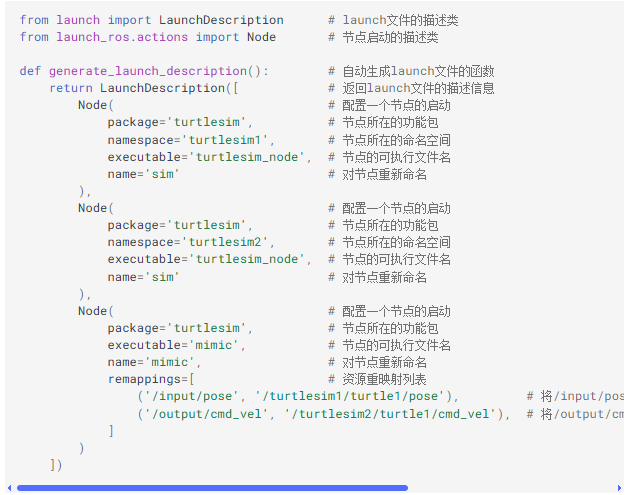

### ROS参数修改

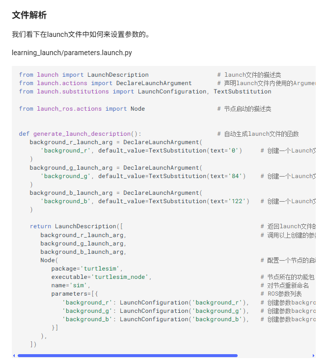

`launch文件中出现的argument和parameter，虽都译为“参数”，但含义不同： - argument：仅限launch文件内部使用，方便在launch中调用某些数值； - parameter：ROS系统的参数，方便在节点见使用某些数值。`

## 